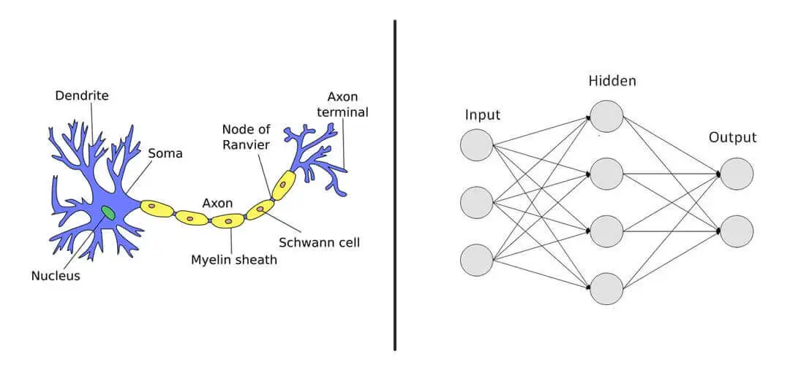
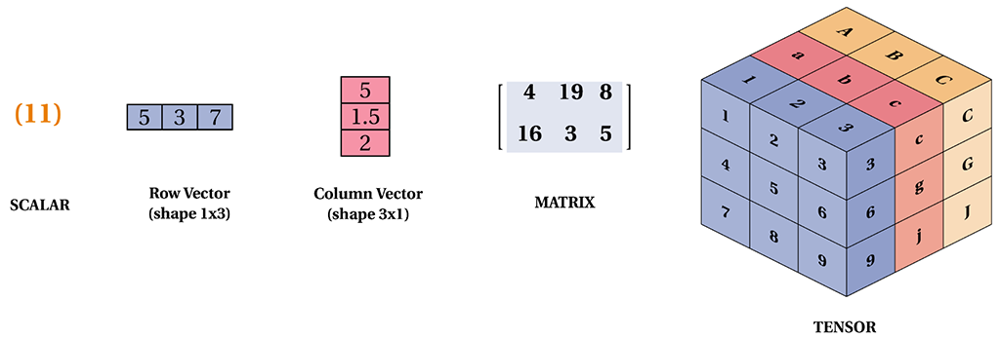

[**🏠 Home**](../README.md) | [**PyTorch Basics ▶️**](../02_PyTorch_Basics/pytorch_basics.md)


### [**Introduction to PyTorch**](#introduction-to-pytorch-1)
- [**What is PyTorch?**](#what-is-pytorch)
- [**Installing PyTorch**](#installing-pytorch)
- [**Neural Networks and Tensors**](#neural-networks-and-tensors)


# Introduction to PyTorch

## What is PyTorch?

PyTorch (https://pytorch.org/) is an open-source machine learning library developed by Facebook's AI Research lab. It provides a flexible and efficient framework for building and training neural networks. PyTorch is known for its dynamic computational graph, which allows for easier debugging and more intuitive development of complex models.

Key features of PyTorch include:
- Dynamic computational graphs
- Automatic differentiation
- GPU acceleration
- Rich ecosystem of tools and libraries


## Installing PyTorch

Visit the official PyTorch website (https://pytorch.org/get-started/locally/) and select the specefications of your system and follow the guide.

General installation command for CPU-only PyTorch:

```bash
pip install torch torchvision torchaudio
```

## Neural Networks and Tensors

### What is a Neural Network?

Artificial Neural Networks (ANN) are inspired by the human brain, but simplified and adapted for computational tasks. A network of interconnected nodes, each representing a neuron. These neurons process information, learn from data, and make predictions.



Image source: https://clevertap.com/blog/neural-networks/

### Tensors: The Building Blocks of Neural Networks

Tensors are multi-dimensional arrays that form the backbone of neural networks. They can be thought of as generalizations of matrices. Here's a breakdown:

- **Scalars:** 0-dimensional tensors (ex: a number).
- **Vectors:** 1-dimensional tensors (ex: a list of numbers).
- **Matrices:** 2-dimensional tensors (ex: 2D grid of numbers).
- **Tensors:** 3D, 4D, or even higher-dimensional arrays.




Image source: https://tensorflownet.readthedocs.io/en/latest/Tensor.html

Tensors are the fundamental data structure in PyTorch. They're similar to NumPy arrays but can be used on GPUs for accelerated computing.Tensors can represent various types of data, such as images (3D tensors), text (2D or 3D tensors), and time series data (2D or 3D tensors). Tensors are used to store and update the network's weights and biases during the learning process. Neural networks perform operations on tensors, such as matrix multiplication, element-wise operations, and activation functions.


[**🏠 Home**](../README.md) | [**PyTorch Basics ▶️**](../02_PyTorch_Basics/pytorch_basics.md)