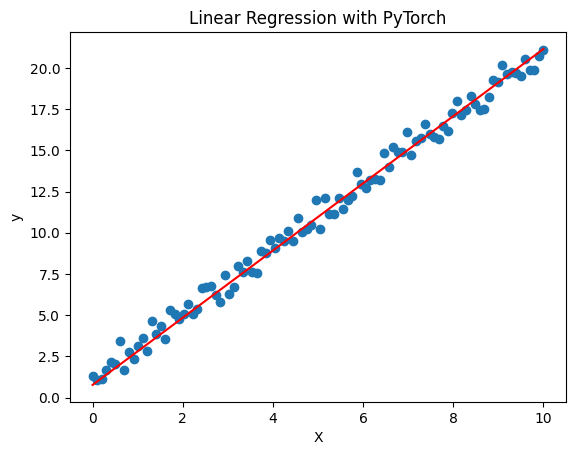

[**🏠 Home**](../README.md) | [**◀️ Introduction to PyTorch**](../01_Introduction_to_PyTorch/introduction_to_pytorch.md) | [**Control Structures ▶️**](../02_Basic_constructs/basic_constructs.md)


### [**PyTorch Basics**](#introduction-to-pytorch-1)

- [**PyTorch Fundamentals**](#pytorch-fundamentals)
- [**Basic Structure of PyTorch Model and Training Loop**](#basic-structure-of-pytorch-model-and-training-loop)


# PyTorch Basics

## PyTorch Fundamentals

Let's dive into some basic PyTorch operations to get you started. We'll cover tensor creation, manipulation, and some fundamental operations.

### Importing PyTorch

Let's import PyTorch:

```python
import torch
```

### Creating Tensors


```python
# Create a tensor from a list
tensor_1 = torch.tensor([1, 2, 3, 4])
print(tensor_1)

# Create a 2D tensor
tensor_2 = torch.tensor([[1, 2], [3, 4]])
print(tensor_2)

# Create a tensor with specific data type
float_tensor = torch.tensor([1.0, 2.0, 3.0], dtype=torch.float32)
print(float_tensor)

# Create a tensor with all zeros
zeros = torch.zeros(3, 4)  # 3x4 tensor
print(zeros)

# Create a tensor with all ones
ones = torch.ones(2, 3)  # 2x3 tensor
print(ones)

# Create a tensor with random values
random_tensor = torch.rand(2, 2)  # 2x2 tensor with random values between 0 and 1
print(random_tensor)
```

### Tensor Operations

PyTorch provides a wide range of operations for manipulating tensors.

```python
# Addition
a = torch.tensor([1, 2, 3])
b = torch.tensor([4, 5, 6])
c = a + b
print(c)

# Multiplication
d = a * b
print(d)

# Matrix multiplication
m1 = torch.tensor([[1, 2], [3, 4]])
m2 = torch.tensor([[5, 6], [7, 8]])
m3 = torch.matmul(m1, m2)
print(m3)

# Reshaping tensors
original = torch.tensor([1, 2, 3, 4, 5, 6])
reshaped = original.reshape(2, 3)
print(reshaped)

# Slicing tensors
sliced = reshaped[:, 1:]  # Select all rows, columns from index 1 onwards
print(sliced)
```

### Autograd: Automatic Differentiation

One of PyTorch's key features is automatic differentiation, which is crucial for training neural networks.

```python
# Create a tensor with requires_grad=True to track computations
x = torch.tensor([2.0], requires_grad=True)
y = x**2 + 3*x + 1

# Compute the gradient
y.backward()

# Print the gradient dy/dx
print(x.grad)
```

### Moving Tensors between CPU and GPU

In PyTorch, tensors can be efficiently moved between the CPU and GPU to leverage the strengths of each device for different tasks. The to() method is commonly used for this purpose, allowing you to specify the desired device (e.g., 'cuda' or 'cpu'). This flexibility enables you to optimize your code's performance based on the nature of your computations and the available hardware resources.

- **Check if GPU is available**

    ```python
    torch.cuda.is_available()
    ```

    ```python 
    device = torch.device('cuda' if torch.cuda.is_available() else 'cpu')
    ```

- **Moving a tensor to the GPU**

    ```python
    # Create a tensor on the CPU
    tensor_cpu = torch.tensor([1.0, 2.0, 3.0])

    # Move the tensor to the GPU
    tensor_gpu = tensor_cpu.to('cuda')

    # Creating a tensor and explicitly moving it to the GPU
    tensor = torch.tensor([1.0, 2.0, 3.0]).cuda()
    ```
- **Moving a tensor from GPU to CPU**

    ```python
    # Move the tensor to the CPU
    tensor_to_cpu = tensor_gpu.to('cpu')

    # Move to CPU using .cpu() method
    tensor_to_cpu = tensor_gpu.cpu()
    ```

**Important!**

- When performing operations on tensors, they must be on the same device (either CPU or GPU). Otherwise, PyTorch will raise an error.

- GPU computations are significantly faster for large tensors or complex operations like matrix multiplications, but for small operations, the data transfer overhead can make CPU execution faster.

By moving data and models to the GPU in PyTorch, we can leverage the powerful parallel computation capabilities of modern GPUs, resulting in faster computations for deep learning tasks.

## Basic Structure of PyTorch Model and Training Loop

PyTorch follows a systematic approach defining structure of a neural network model and its training loop. 

### Model Structure

In PyTorch, neural networks are defined as classes that inherit from `torch.nn.Module`. This is where we define the architecture of the model, including its layers and the forward pass.

```python
import torch
import torch.nn as nn

# Define a simple neural network
class SimpleModel(nn.Module):
    def __init__(self):
        super(SimpleModel, self).__init__()
        # Define layers: a single fully connected layer
        self.fc = nn.Linear(10, 1)
    
    def forward(self, x):
        # Define the forward pass (input -> layer -> output)
        return self.fc(x)

# Instantiate the model
model = SimpleModel()
```

### Defining the Loss Function and Optimizer

Training a neural network model is an optimization problem where we try to minimize the loss function by adjusting the model's parameters (weights and biases) using optimization algorithms. The goal is to find the set of parameters that allow the model to make accurate predictions on unseen data.

- **Loss Function:** Measures how far the model's predictions are from the actual target values. Common choices include `nn.MSELoss()` for regression and `nn.CrossEntropyLoss()` for classification.

- **Optimizer:** Updates the model's parameters to minimize the loss function. Popular choices include `torch.optim.SGD` (Stochastic Gradient Descent) and `torch.optim.Adam`.

```python
# Loss function: Mean Squared Error Loss (for regression)
criterion = nn.MSELoss()

# Optimizer: Stochastic Gradient Descent
optimizer = torch.optim.SGD(model.parameters(), lr=0.01)
```

### Training Loop

The training loop is the core of model training. It involves iterating over the data, performing the following steps:

- **Zero gradients:** Reset gradients from the previous step using `optimizer.zero_grad()`.
- **Forward pass:** Compute the predicted outputs by passing inputs through the model.
- **Compute loss:** Measure how far the predictions are from the ground truth using the loss function.
- **Backward pass:** Compute gradients using `loss.backward()`.
- **Update weights:** Update model parameters using `optimizer.step()`.

```python
# Training loop
epochs = 100
for epoch in range(epochs):
    # Forward pass
    y_pred = model(X)
    loss = criterion(y_pred, y)
    
    # Backward pass and optimize
    optimizer.zero_grad()
    loss.backward()
    optimizer.step()
```

Let's put these concepts together in a practical example. We'll implement a simple linear regression model.

```python
import torch
import torch.nn as nn
import torch.optim as optim
import matplotlib.pyplot as plt

# Generate sample data
X = torch.linspace(0, 10, 100).reshape(-1, 1)
y = 2*X + 1 + torch.randn(100, 1)*0.5

# Define the model
class LinearRegression(nn.Module):
    def __init__(self):
        super().__init__()
        self.linear = nn.Linear(1, 1)
    
    def forward(self, x):
        return self.linear(x)

# Init the model, loss function, and optimizer
model = LinearRegression()
criterion = nn.MSELoss()
optimizer = optim.SGD(model.parameters(), lr=0.01)

# Training loop
epochs = 100
for epoch in range(epochs):
    # Forward pass
    y_pred = model(X)
    loss = criterion(y_pred, y)
    
    # Backward pass and optimize
    optimizer.zero_grad()
    loss.backward()
    optimizer.step()
    
    if (epoch+1) % 10 == 0:
        print(f'Epoch [{epoch+1}/{epochs}], Loss: {loss.item():.4f}')

# Plot the results
plt.scatter(X.numpy(), y.numpy())
plt.plot(X.numpy(), model(X).detach().numpy(), 'r')
plt.xlabel('X')
plt.ylabel('y')
plt.title('Linear Regression with PyTorch')
plt.show()
```

Result:



This demonstrates the basic steps of building a neural network model and use it for inference:

1. Creating a simple neural network model (LinearRegression)
2. Define a loss function and optimizer
3. Implement a training loop
4. Use the trained model for predictions
5. Visualize the results


[**🏠 Home**](../README.md) | [**◀️ Introduction to PyTorch**](../01_Introduction_to_PyTorch/introduction_to_pytorch.md) | [**Control Structures ▶️**](../02_Basic_constructs/basic_constructs.md)