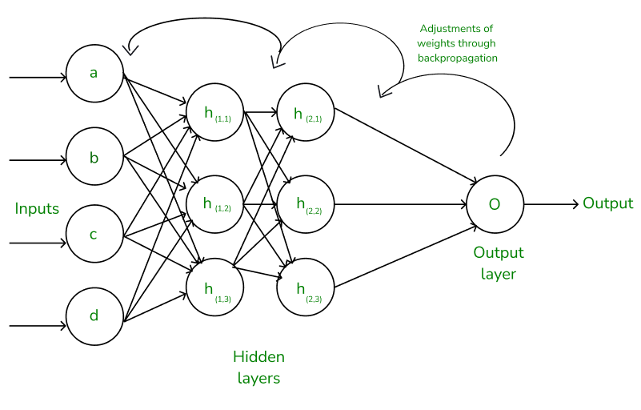

[**🏠 Home**](../README.md) | [**◀️ PyTorch Basics**](../02_PyTorch_Basics/pytorch_basics.md) | [**Convolutional Neural Networks (CNNs) ▶️**](../04_Convolutional_Neural_Networks/convolutional_neural_networks.md)


### [**Feedforward Neural Networks**](#feedforward-neural-networks-1)

- [**Fully Connected Layers**](#fully-connected-layers)

- [**Activation Functions**](#activation-functions)

- [**Building a Simple Feedforward Neural Network**](#building-a-simple-feedforward-neural-network)
    - [**Forward Propagation**](#forward-propagation)
    - [**Backward Propagation and Optimization**](#backward-propagation-and-optimization)

- [**Training and Evaluating Models**](#training-and-evaluating-models)
    - [**Training the Network**](#training-the-network)
    - [**Evaluating the Model**](#evaluating-the-model)

- [**Advanced Concepts**](#advanced-concepts)
    - Dropout
    - Batch Normalization
- [**Logistic Regression**](#activation-functions)
- [**Multi-Class Classification**](#activation-functions)


# Feedforward Neural Networks

Feedforward Neural Networks, also known as Multi-Layer Perceptrons (MLPs), are the foundation of deep learning. They consist of an input layer, one or more hidden layers, and an output layer. Information flows in one direction, from input to output, hence the name "feedforward."


Image Source: https://mukulrathi.com/demystifying-deep-learning/feed-forward-neural-network/

## Fully Connected Layers

Fully connected layers, also known as dense layers, are the building blocks of feedforward neural networks. In a fully connected layer, each neuron is connected to every neuron in the previous layer.


Image Source: https://docs.nvidia.com/deeplearning/performance/dl-performance-fully-connected/index.html

In PyTorch, we can create a fully connected layer using the `nn.Linear` module:

```python
input_size = 10
output_size = 5
fc_layer = nn.Linear(input_size, output_size)
```

This creates a fully connected layer with 10 input neurons and 5 output neurons.

## Activation Functions


Image Source: https://www.v7labs.com/blog/neural-networks-activation-functions

Activation functions introduce non-linearity into the network, allowing it to learn complex patterns. Some common activation functions include:

1. ReLU (Rectified Linear Unit)
2. Sigmoid
3. Tanh
4. Leaky ReLU


Image Source: https://www.v7labs.com/blog/neural-networks-activation-functions

```python
class ActivationFunctions:
    @staticmethod
    def relu(x):
        return torch.max(torch.tensor(0.0), x)
    
    @staticmethod
    def sigmoid(x):
        return 1 / (1 + torch.exp(-x))
    
    @staticmethod
    def tanh(x):
        return torch.tanh(x)
    
    @staticmethod
    def leaky_relu(x, alpha=0.01):
        return torch.max(alpha * x, x)

# PyTorch also provides built-in activation functions
pytorch_relu = nn.ReLU()
pytorch_sigmoid = nn.Sigmoid()
pytorch_tanh = nn.Tanh()
pytorch_leaky_relu = nn.LeakyReLU()
```

Further reading: https://www.v7labs.com/blog/neural-networks-activation-functions

## Building Feedforward Neural Network

Now, let's build a simple feedforward neural network using PyTorch:

```python
class SimpleFFNN(nn.Module):
    def __init__(self, input_size, hidden_size, output_size):
        super(SimpleFFNN, self).__init__()
        self.fc1 = nn.Linear(input_size, hidden_size)
        self.relu = nn.ReLU()
        self.fc2 = nn.Linear(hidden_size, output_size)
    
    def forward(self, x):
        x = self.fc1(x)
        x = self.relu(x)
        x = self.fc2(x)
        return x

# Create an instance of the network
input_size = 10
hidden_size = 20
output_size = 5
model = SimpleFFNN(input_size, hidden_size, output_size)
```

### Forward Propagation

Forward propagation is the process of passing input data through the network's layers to produce an output or prediction. In PyTorch, this is automatically handled when we call the model on our input data:

```python
# Generate random input data
batch_size = 32
input_data = torch.randn(batch_size, input_size)

# Perform forward propagation
output = model(input_data)
print(f"Output shape: {output.shape}")
```

### Backward Propagation and Optimization

Backward propagation, or backpropagation, is the algorithm used to calculate gradients of the loss function with respect to the network's parameters. These gradients are then used to update the parameters during optimization. In PyTorch, we use an optimizer to update the model's parameters based on the computed gradients.



Image Source: https://www.geeksforgeeks.org/backpropagation-in-neural-network/

```python
# Define loss function and optimizer
criterion = nn.MSELoss()
optimizer = optim.Adam(model.parameters(), lr=0.01)

# Generate random target data
target = torch.randn(batch_size, output_size)

# Forward pass
output = model(input_data)

# Compute loss
loss = criterion(output, target)

# Backward pass and optimization
optimizer.zero_grad()
loss.backward()
optimizer.step()
```

Further reading: https://www.geeksforgeeks.org/backpropagation-in-neural-network/


## Training and Evaluating Models

### Training the Network

Now, let's put it all together and train our network.

```python
def train_model(model, epochs, batch_size, input_size, output_size):
    criterion = nn.MSELoss()
    optimizer = optim.Adam(model.parameters(), lr=0.01)
    
    for epoch in range(epochs):
        running_loss = 0.0
        for i in range(100):  # 100 batches per epoch
            # Generate random data
            inputs = torch.randn(batch_size, input_size)
            targets = torch.randn(batch_size, output_size)
            
            # Zero the parameter gradients
            optimizer.zero_grad()
            
            # Forward pass
            outputs = model(inputs)
            loss = criterion(outputs, targets)
            
            # Backward pass and optimize
            loss.backward()
            optimizer.step()
            
            running_loss += loss.item()
        
        print(f"Epoch {epoch+1}, Loss: {running_loss/100:.4f}")

# Train the model
train_model(model, epochs=10, batch_size=32, input_size=input_size, output_size=output_size)
```

### Evaluating the Model

After training, we need to evaluate our model's performance on unseen data:

```python
def evaluate_model(model, input_size, output_size, num_samples=1000):
    model.eval()  # Set the model to evaluation mode
    with torch.no_grad():
        inputs = torch.randn(num_samples, input_size)
        targets = torch.randn(num_samples, output_size)
        
        outputs = model(inputs)
        loss = nn.MSELoss()(outputs, targets)
        
    print(f"Evaluation Loss: {loss.item():.4f}")

# Evaluate the model
evaluate_model(model, input_size, output_size)
```

## Advanced Concepts

### Dropout


Image Source: https://jmlr.org/papers/volume15/srivastava14a/srivastava14a.pdf

Dropout is a regularization technique used in neural networks to prevent overfitting. During training, it randomly deactivates neurons with a certain probability, forcing the network to learn more robust and independent features. This helps the model generalize better to unseen data and reduces the risk of memorizing the training set.

```python
class FFNNWithDropout(nn.Module):
    def __init__(self, input_size, hidden_size, output_size, dropout_rate=0.5):
        super(FFNNWithDropout, self).__init__()
        self.fc1 = nn.Linear(input_size, hidden_size)
        self.relu = nn.ReLU()
        self.dropout = nn.Dropout(dropout_rate)
        self.fc2 = nn.Linear(hidden_size, output_size)
    
    def forward(self, x):
        x = self.fc1(x)
        x = self.relu(x)
        x = self.dropout(x)
        x = self.fc2(x)
        return x
```

### Batch Normalization


Image Source: https://www.semanticscholar.org/paper/Convergence-Analysis-of-Batch-Normalization-for-Ma-Klabjan/8b9660b112b5c673e67d46c905c83eff83951b1d/figure/0

Batch Normalization is a technique used in neural networks to normalize the inputs of each layer, making the training process more stable and efficient. It involves calculating the mean and standard deviation of a mini-batch of data during training and then normalizing the inputs accordingly. This helps to prevent vanishing or exploding gradients, which can occur in deep neural networks.

```python
class FFNNWithBatchNorm(nn.Module):
    def __init__(self, input_size, hidden_size, output_size):
        super(FFNNWithBatchNorm, self).__init__()
        self.fc1 = nn.Linear(input_size, hidden_size)
        self.bn1 = nn.BatchNorm1d(hidden_size)
        self.relu = nn.ReLU()
        self.fc2 = nn.Linear(hidden_size, output_size)
    
    def forward(self, x):
        x = self.fc1(x)
        x = self.bn1(x)
        x = self.relu(x)
        x = self.fc2(x)
        return x
```

## Logistic Regression

Logistic regression is a special case of a neural network, typically used for binary classification. It's essentially a single-layer neural network with a sigmoid activation function.

The model takes 10 input features and outputs a probability of having diabetes. We've used the sigmoid activation function to ensure the output is between 0 and 1.

```python
import torch
import torch.nn as nn
import torch.optim as optim
import numpy as np
from sklearn.datasets import load_diabetes
from sklearn.model_selection import train_test_split
from sklearn.preprocessing import StandardScaler
from sklearn.metrics import confusion_matrix, ConfusionMatrixDisplay
from sklearn.metrics import accuracy_score, precision_score, recall_score, f1_score, classification_report

import seaborn as sns
import matplotlib.pyplot as plt

# Load and preprocess the data
diabetes = load_diabetes()
X, y = diabetes.data, diabetes.target
y = (y > y.mean()).astype(int)  # Convert to binary classification
X_train, X_test, y_train, y_test = train_test_split(X, y, test_size=0.2, random_state=42)

scaler = StandardScaler()
X_train = scaler.fit_transform(X_train)
X_test = scaler.transform(X_test)

# Convert to PyTorch tensors
X_train = torch.FloatTensor(X_train)
y_train = torch.FloatTensor(y_train).unsqueeze(1)
X_test = torch.FloatTensor(X_test)
y_test = torch.FloatTensor(y_test).unsqueeze(1)

# Define the logistic regression model
class LogisticRegression(nn.Module):
    def __init__(self, input_dim):
        super(LogisticRegression, self).__init__()
        self.linear = nn.Linear(input_dim, 1)
        
    def forward(self, x):
        return torch.sigmoid(self.linear(x))

# Initialize the model, loss function, and optimizer
model = LogisticRegression(X_train.shape[1])
criterion = nn.BCELoss()
optimizer = optim.SGD(model.parameters(), lr=0.01)

# Store the loss values
loss_values = []

# Training loop
num_epochs = 1000
for epoch in range(num_epochs):
    # Forward pass
    outputs = model(X_train)
    loss = criterion(outputs, y_train)
    loss_values.append(loss.item())
    
    # Backward pass and optimize
    optimizer.zero_grad()
    loss.backward()
    optimizer.step()
    
    if (epoch + 1) % 100 == 0:
        print(f'Epoch [{epoch+1}/{num_epochs}], Loss: {loss.item():.4f}')

# Evaluate the model
with torch.no_grad():
    predicted = model(X_test)
    predicted_classes = predicted.round()
    accuracy = (predicted_classes == y_test).float().mean()
    print(f'Test Accuracy: {accuracy.item():.2f}')

plt.figure(figsize=(8, 6))

# Plot the loss values over the epochs
plt.plot(range(num_epochs), loss_values)
plt.xlabel('Epoch')
plt.ylabel('Loss')
plt.title('Loss over Epochs')
plt.show()

# Convert to numpy arrays for confusion matrix computation
predicted_classes_np = predicted_classes.numpy()
y_test_np = y_test.numpy()

# Compute accuracy, precision, recall, and F1 score
accuracy = accuracy_score(y_test_np, predicted_classes_np)
precision = precision_score(y_test_np, predicted_classes_np)
recall = recall_score(y_test_np, predicted_classes_np)
f1 = f1_score(y_test_np, predicted_classes_np)

# Print the performance metrics
print(f'Accuracy: {accuracy:.2f}')
print(f'Precision: {precision:.2f}')
print(f'Recall: {recall:.2f}')
print(f'F1 Score: {f1:.2f}')

# Print full classification report
print("\nClassification Report:")
print(classification_report(y_test_np, predicted_classes_np))

# Compute confusion matrix
cm = confusion_matrix(y_test_np, predicted_classes_np)

# Plot confusion matrix
plt.figure(figsize=(8, 6))
sns.heatmap(cm, annot=True, fmt="d", cmap="Blues", cbar=False)
plt.title('Confusion Matrix')
plt.xlabel('Predicted')
plt.ylabel('True')
plt.show()
```


Training Loss


Model performance


Confusion matrix

## Multi-Class Classification 

Classification is a common task in machine learning where we predict a categorical label for a given input. Let's implement a neural network to classify iris flowers using the famous Iris dataset.


```python
import torch
import torch.nn as nn
import torch.optim as optim
from sklearn.datasets import load_iris
from sklearn.model_selection import train_test_split
from sklearn.preprocessing import StandardScaler

# Load and preprocess the data
iris = load_iris()
X = iris['data']
y = iris['target']
names = iris['target_names']
feature_names = iris['feature_names']

scaler = StandardScaler()
X_scaled = scaler.fit_transform(X)

X_train, X_test, y_train, y_test = train_test_split(
    X_scaled, y, test_size=0.2, random_state=2)

# Convert to PyTorch tensors
X_train = torch.FloatTensor(X_train)
y_train = torch.LongTensor(y_train)
X_test = torch.FloatTensor(X_test)
y_test = torch.LongTensor(y_test)

# Define the neural network
class IrisClassifier(nn.Module):
    def __init__(self):
        super(IrisClassifier, self).__init__()
        self.fc1 = nn.Linear(4, 10)
        self.fc2 = nn.Linear(10, 3)
        self.relu = nn.ReLU()

    def forward(self, x):
        x = self.relu(self.fc1(x))
        x = self.fc2(x)
        return x

# Initialize the model, loss function, and optimizer
model = IrisClassifier()
criterion = nn.CrossEntropyLoss()
optimizer = optim.Adam(model.parameters(), lr=0.01)

# Training loop
num_epochs = 100
for epoch in range(num_epochs):
    # Forward pass
    outputs = model(X_train)
    loss = criterion(outputs, y_train)
    
    # Backward pass and optimize
    optimizer.zero_grad()
    loss.backward()
    optimizer.step()
    
    if (epoch + 1) % 10 == 0:
        print(f'Epoch [{epoch+1}/{num_epochs}], Loss: {loss.item():.4f}')

# Evaluate the model
with torch.no_grad():
    outputs = model(X_test)
    _, predicted = torch.max(outputs.data, 1)
    accuracy = (predicted == y_test).sum().item() / len(y_test)
    print(f'Test Accuracy: {accuracy:.2f}')

# Model performance metrics
y_test_np = y_test.numpy()
predicted_np = predicted.numpy()

print("\nClassification Report:")
print(classification_report(y_test_np, predicted_np, target_names=iris.target_names))

# Confusion matrix
cm = confusion_matrix(y_test_np, predicted_np)
plt.figure(figsize=(6, 4))
sns.heatmap(cm, annot=True, fmt="d", cmap="Blues", cbar=False,
            xticklabels=iris.target_names, yticklabels=iris.target_names)
plt.title("Confusion Matrix")
plt.xlabel("Predicted Class")
plt.ylabel("True Class")
plt.show()


fig, (ax1, ax2) = plt.subplots(1, 2, figsize=(16, 6))
for target, target_name in enumerate(names):
    X_plot = X[y == target]
    ax1.plot(X_plot[:, 0], X_plot[:, 1], 
             linestyle='none', 
             marker='o', 
             label=target_name)
    
ax1.set_xlabel(feature_names[0])
ax1.set_ylabel(feature_names[1])
ax1.axis('equal')
ax1.legend()

for target, target_name in enumerate(names):
    X_plot = X[y == target]
    ax2.plot(X_plot[:, 2], X_plot[:, 3], 
             linestyle='none', 
             marker='o', 
             label=target_name)
ax2.set_xlabel(feature_names[2])
ax2.set_ylabel(feature_names[3])
ax2.axis('equal')
ax2.legend()
```


Model performance


Confusion Matrix

## Real-world Application: Credit Risk Assessment

Let's apply our knowledge to a real-world problem: credit risk assessment. We'll create a model that predicts the probability of a loan default based on various features.

```python
import pandas as pd
from sklearn.model_selection import train_test_split
from sklearn.preprocessing import StandardScaler

# Load and preprocess the data
data = pd.read_csv('credit_data.csv')  # You'll need to provide your own dataset
X = data.drop('loan_default', axis=1)
y = data['loan_default']

# Split the data
X_train, X_test, y_train, y_test = train_test_split(X, y, test_size=0.2, random_state=42)

# Scale the features
scaler = StandardScaler()
X_train_scaled = scaler.fit_transform(X_train)
X_test_scaled = scaler.transform(X_test)

# Convert to PyTorch tensors
X_train_tensor = torch.FloatTensor(X_train_scaled)
y_train_tensor = torch.FloatTensor(y_train.values)
X_test_tensor = torch.FloatTensor(X_test_scaled)
y_test_tensor = torch.FloatTensor(y_test.values)

# Define the model
class CreditRiskModel(nn.Module):
    def __init__(self, input_size):
        super(CreditRiskModel, self).__init__()
        self.fc1 = nn.Linear(input_size, 64)
        self.bn1 = nn.BatchNorm1d(64)
        self.fc2 = nn.Linear(64, 32)
        self.bn2 = nn.BatchNorm1d(32)
        self.fc3 = nn.Linear(32, 1)
        self.relu = nn.ReLU()
        self.dropout = nn.Dropout(0.3)
        self.sigmoid = nn.Sigmoid()
    
    def forward(self, x):
        x = self.fc1(x)
        x = self.bn1(x)
        x = self.relu(x)
        x = self.dropout(x)
        x = self.fc2(x)
        x = self.bn2(x)
        x = self.relu(x)
        x = self.dropout(x)
        x = self.fc3(x)
        x = self.sigmoid(x)
        return x

# Initialize the model
input_size = X_train.shape[1]
model = CreditRiskModel(input_size)

# Train the model
criterion = nn.BCELoss()
optimizer = optim.Adam(model.parameters(), lr=0.001)

num_epochs = 100
batch_size = 32

for epoch in range(num_epochs):
    model.train()
    for i in range(0, len(X_train_tensor), batch_size):
        batch_X = X_train_tensor[i:i+batch_size]
        batch_y = y_train_tensor[i:i+batch_size].unsqueeze(1)
        
        optimizer.zero_grad()
        outputs = model(batch_X)
        loss = criterion(outputs, batch_y)
        loss.backward()
        optimizer.step()
    
    # Evaluate on the test set
    model.eval()
    with torch.no_grad():
        test_outputs = model(X_test_tensor)
        test_loss = criterion(test_outputs, y_test_tensor.unsqueeze(1))
        test_accuracy = ((test_outputs.round() == y_test_tensor.unsqueeze(1)).float().mean())
    
    print(f"Epoch {epoch+1}/{num_epochs}, Test Loss: {test_loss:.4f}, Test Accuracy: {test_accuracy:.4f}")

# Make predictions
model.eval()
with torch.no_grad():
    predictions = model(X_test_tensor)
    predicted_classes = predictions.round()

# Calculate and print the final accuracy
accuracy = (predicted_classes == y_test_tensor.unsqueeze(1)).float().mean()
print(f"Final Test Accuracy: {accuracy:.4f}")
```

This demonstrates applying a feedforward neural network to a real-world problem of credit risk assessment. The model takes various features of a loan applicant and predicts the probability of loan default.


[**🏠 Home**](../README.md) | [**◀️ PyTorch Basics**](../02_PyTorch_Basics/pytorch_basics.md) | [**Convolutional Neural Networks (CNNs) ▶️**](../04_Convolutional_Neural_Networks/convolutional_neural_networks.md)