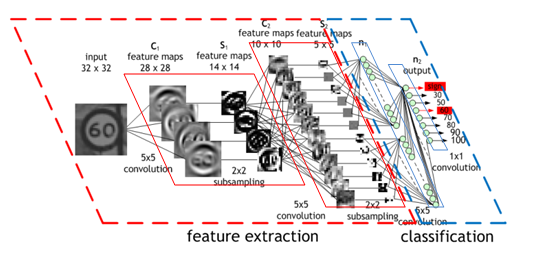
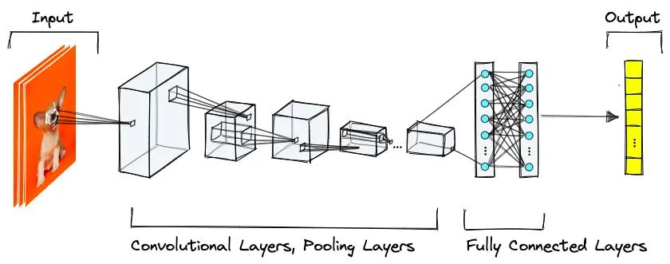
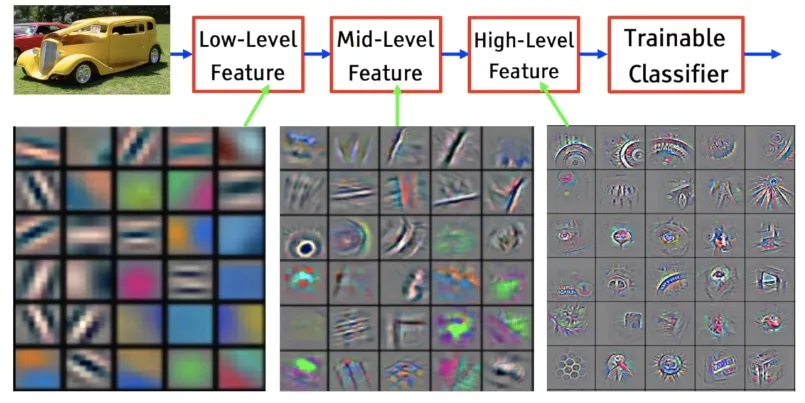
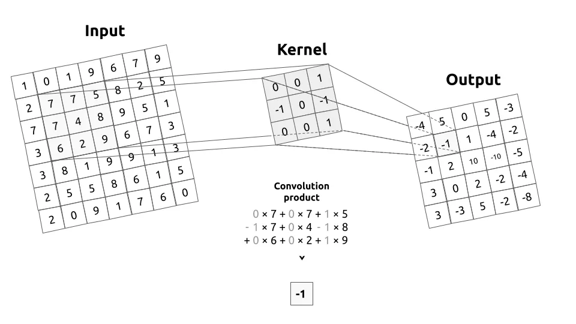
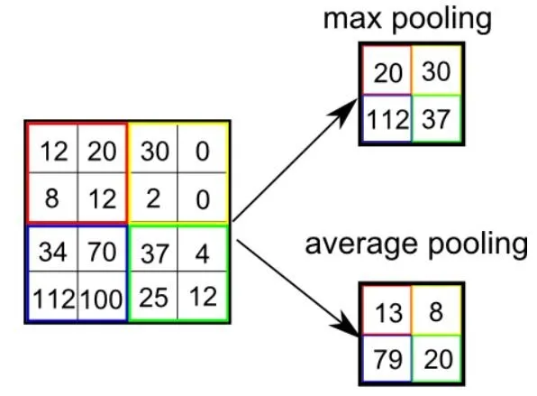

[**🏠 Home**](../README.md) | [**◀️ Feedforward Neural Networks**](../03_Feedforward_Neural_Networks/feedforward_neural_networks.md) | [**Convolutional Neural Networks (CNNs) ▶️**](../02_Basic_constructs/basic_constructs.md)


### [**Convolutional Neural Networks (CNNs)**](#convolutional-neural-networks-cnns-1)

- [**Introduction to CNNs**](#introduction-to-cnns)
    - The Concept of Convolution
    - Applications of CNNs
- [**Architecture of CNNs**](#architecture-of-cnns)
    - The architecture inspired by the human brain
    - Concept of Receptive Field and how neurons respond to stimuli
- [**Why Use CNNs?**](#why-use-cnns)

- [**Components of CNNs**](#components-of-cnns)
    - Convolution Layer
    - Pooling Layer
    - Activation Functions
- [**CNN Layers Implementation**](#cnn-layers-implementation)
    - Step-by-step process of how CNNs understand features
    - From Convolution and Pooling to Classification
    - Building a CNN model for MNIST digit classification
- [**Advanced CNN Architectures**](#advanced-cnn-architectures)
    - LeNet-5
    - AlexNet
    - VGGNet
    - GoogLeNet (InceptionNet)
    - Residual Networks (ResNets)


# Convolutional Neural Networks (CNNs)

## Introduction to CNNs

Convolutional Neural Networks (CNNs) are a class of deep learning models particularly effective for processing structured grid-like or sequential data. It's a fundamental building block in various fields, including computer vision, natural language processing, and signal processing. They have revolutionized computer vision tasks and have found applications in various domains.



Image Source: http://parse.ele.tue.nl/mpeemen

### The Concept of Convolution

At the heart of CNNs is the convolution operation. In the context of image processing, convolution involves sliding a small window (kernel) over an image and performing element-wise multiplication and summation to produce a feature map.


Image Source: https://towardsdatascience.com/a-comprehensive-guide-to-convolutional-neural-networks-the-eli5-way-3bd2b1164a53

Convolution operation can be performed multi-dimentiaonally.  It provides a powerful tool for extracting features from data of various dimensions.

- **1D Convolution:** Used for processing sequences, like time series or text data.
- **2D Convolution:** This operation is used to detect features such as edges, corners, and textures.
- **3D Convolution:** Employed for processing volumetric data, such as medical images or 3D videos.
- **4D Convolution:** Suitable for spatiotemporal data, like video sequences with both spatial and temporal dimensions.

### Applications of CNNs

CNNs have diverse applications across various domains.

- **Image Recognition and Segmentation:** CNNs excel at tasks like object detection, face recognition, and semantic segmentation.
- **Natural Language Processing:** They're used for text classification, sentiment analysis, and machine translation.
- **Audio Processing:** CNNs can be applied to speech recognition and music genre classification.
- **Time Series Prediction:** They're effective for forecasting in financial markets and weather prediction.

## Architecture of CNNs

CNNs are inspired by the organization of the animal visual cortex. They consist of multiple layers that process input data to extract increasingly complex features.



Image Source: https://www.pinecone.io/learn/series/image-search/cnn/

### Explanation of the Architecture

The architecture of a CNN typically includes:

- Convolutional layers
- Pooling layers
- Activation functions
- Fully connected layers

### Concept of Receptive Field

The receptive field refers to the region in the input space that a particular CNN feature is looking at. As we go deeper into the network, the receptive field increases, allowing the network to capture more complex and abstract features.

## Why Use CNNs?

CNNs are particularly well-suited for computer vision, image processing and signal processing tasks due to their ability to efficiently capture spatial hierarchies and patterns in data.



Image Source: https://medium.com/analytics-vidhya/the-world-through-the-eyes-of-cnn-5a52c034dbeb

The main features of CNNs are:

- **Local Receptive Fields:** CNNs use convolutional layers that focus on small regions of an image, allowing the network to detect local patterns like edges, textures, or shapes.

- **Parameter Sharing:** Filters in CNNs are applied across the entire image, drastically reducing the number of parameters compared to fully connected networks, making the model more efficient and less prone to overfitting.

- **Hierarchical Feature Extraction:** CNNs naturally learn features in a hierarchical manner, from low-level features (edges, corners) in early layers to complex patterns (faces, objects) in deeper layers.

- **Translation Invariance:** By recognizing patterns anywhere in the image, CNNs offer robustness to slight variations in the input, such as position, rotation, or scale of objects.

- **Capturing Spatial Patterns:** CNNs can extract spatial features from each frame (in the case of videos) or from different locations in data (for spatial time-series). This enables the network to recognize objects, shapes, or spatial correlations within the data.

## Components of CNNs

Let's dive into the key components of CNNs and implement them using PyTorch.

### Convolution Layer

The convolution layer is the core building block of a CNN. It performs a dot product between a region of the input and a kernel (filter).

Key concepts of Convolution:

- **Filter Size:** The size of the filter determines the receptive field of the convolution operation.
- **Strides:** The stride controls the movement of the filter across the input.
- **Padding:** Padding can be used to control the output size and prevent information loss at the edges.
- **Dilation:** Dilation increases the receptive field without changing the filter size.


Image Source: https://towardsdatascience.com/a-comprehensive-guide-to-convolutional-neural-networks-the-eli5-way-3bd2b1164a53



Image Source: https://svitla.com/blog/cnn-for-image-processing/

```python
import torch
import torch.nn as nn

# Define a simple convolution layer
conv_layer = nn.Conv2d(in_channels=1, out_channels=16, kernel_size=3, stride=1, padding=1)

# Create a sample input
input_image = torch.randn(1, 1, 28, 28)  # (batch_size, channels, height, width)

# Apply convolution
output = conv_layer(input_image)
```

### Pooling Layer

Pooling layers reduce the spatial dimensions of the feature maps, helping to control overfitting and reduce computational complexity.



Image Source: https://towardsdatascience.com/a-comprehensive-guide-to-convolutional-neural-networks-the-eli5-way-3bd2b1164a53

```python
# Define a max pooling layer
pool_layer = nn.MaxPool2d(kernel_size=2, stride=2)

# Apply pooling to the previous output
pooled_output = pool_layer(output)
```

### Activation Functions

Activation functions introduce non-linearity into the network, allowing it to learn complex patterns.

```python
# ReLU activation
relu = nn.ReLU()
activated_output = relu(pooled_output)

# Other common activation functions
# sigmoid = nn.Sigmoid()
# tanh = nn.Tanh()
```

## CNN Layers Implementation

Let's build a simple CNN for the MNIST digit classification task to see how these components work together.

```python
import torch
import torch.nn as nn
import torch.optim as optim
from torchvision import datasets, transforms
from torch.utils.data import DataLoader

# Define the CNN model
class SimpleCNN(nn.Module):
    def __init__(self):
        super(SimpleCNN, self).__init__()
        self.conv1 = nn.Conv2d(1, 32, kernel_size=3, stride=1, padding=1)
        self.pool = nn.MaxPool2d(kernel_size=2, stride=2)
        self.conv2 = nn.Conv2d(32, 64, kernel_size=3, stride=1, padding=1)
        self.fc1 = nn.Linear(64 * 7 * 7, 128)
        self.fc2 = nn.Linear(128, 10)
        self.relu = nn.ReLU()

    def forward(self, x):
        x = self.pool(self.relu(self.conv1(x)))
        x = self.pool(self.relu(self.conv2(x)))
        x = x.view(-1, 64 * 7 * 7)
        x = self.relu(self.fc1(x))
        x = self.fc2(x)
        return x

# Set up data loaders
transform = transforms.Compose([transforms.ToTensor(), transforms.Normalize((0.1307,), (0.3081,))])
train_dataset = datasets.MNIST(root='./data', train=True, download=True, transform=transform)
test_dataset = datasets.MNIST(root='./data', train=False, download=True, transform=transform)
train_loader = DataLoader(train_dataset, batch_size=64, shuffle=True)
test_loader = DataLoader(test_dataset, batch_size=1000, shuffle=False)

# Init the model, loss function, and optimizer
model = SimpleCNN()
criterion = nn.CrossEntropyLoss()
optimizer = optim.Adam(model.parameters(), lr=0.001)

# Training loop
def train(model, train_loader, criterion, optimizer, epochs=5):
    model.train()
    for epoch in range(epochs):
        for batch_idx, (data, target) in enumerate(train_loader):
            optimizer.zero_grad()
            output = model(data)
            loss = criterion(output, target)
            loss.backward()
            optimizer.step()
            if batch_idx % 100 == 0:
                print(f'Epoch {epoch+1}/{epochs}, Batch {batch_idx}/{len(train_loader)}, Loss: {loss.item():.4f}')

# Train the model
train(model, train_loader, criterion, optimizer)

# Evaluation
def test(model, test_loader):
    model.eval()
    correct = 0
    total = 0
    with torch.no_grad():
        for data, target in test_loader:
            output = model(data)
            _, predicted = torch.max(output.data, 1)
            total += target.size(0)
            correct += (predicted == target).sum().item()
    print(f'Accuracy on test set: {100 * correct / total:.2f}%')

# Test the model
test(model, test_loader)
```

This example demonstrates a complete CNN implementation for MNIST digit classification, including data loading, model definition, training, and evaluation.

### Classification with CNNs

The fully connected layers at the end of the CNN architecture are responsible for the final classification task. They take the high-level features learned by the convolutional and pooling layers and map them to the output classes.

In our SimpleCNN model, we used two fully connected layers:

```python
self.fc1 = nn.Linear(64 * 7 * 7, 128)
self.fc2 = nn.Linear(128, 10)
```

The first layer (fc1) reduces the dimensionality of the flattened feature maps, and the second layer (fc2) produces the final output with 10 neurons, corresponding to the 10 digit classes in MNIST.


## Advanced CNN Architectures

While we've implemented a simple CNN, there are several famous architectures that have pushed the boundaries of what's possible with CNNs:

- **LeNet-5:** One of the earliest CNNs, used for digit recognition.
- **AlexNet:** Winner of the 2012 ImageNet competition, it brought CNNs into the spotlight.
- **VGGNet:** Known for its simplicity and depth.
- **GoogLeNet (InceptionNet):** Introduced the concept of inception modules.
- **ResNet:** Introduced skip connections, allowing for much deeper networks.


In conclusion, Convolutional Neural Networks have revolutionized the field of computer vision and have found applications in various domains. By understanding their architecture and components we can leverage the power of CNNs for a wide range of tasks. The PyTorch framework provides a flexible and intuitive way to build and train CNN networks.

Further reading: https://svitla.com/blog/cnn-for-image-processing/


[**🏠 Home**](../README.md) | [**◀️ Feedforward Neural Networks**](../03_Feedforward_Neural_Networks/feedforward_neural_networks.md) | [**Convolutional Neural Networks (CNNs) ▶️**](../02_Basic_constructs/basic_constructs.md)

