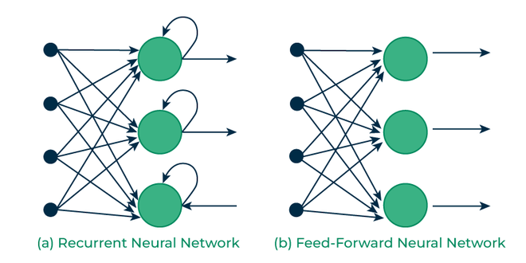
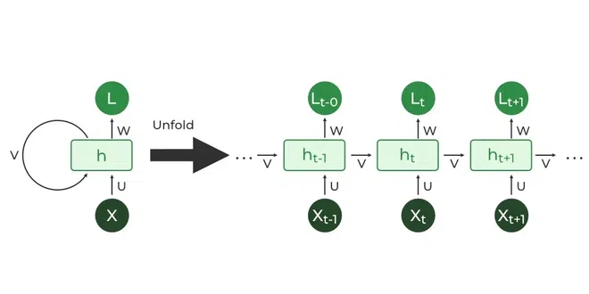
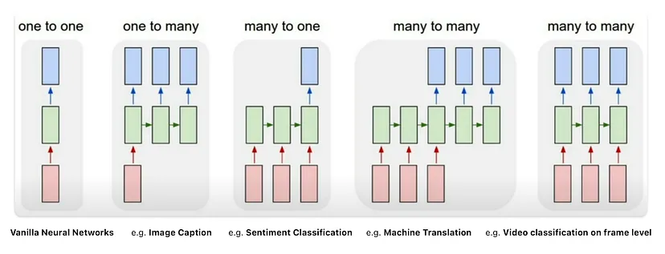

[**🏠 Home**](../README.md) | [**◀️ Convolutional Neural Networks (CNNs)**](../04_Convolutional_Neural_Networks/convolutional_neural_networks.md) | [**Long Short-Term Memory (LSTM) Networks ▶️**](../02_Basic_constructs/basic_constructs.md)


### [**Recurrent Neural Networks (RNNs)**](#recurrent-neural-networks-rnns-1)

- [**Introduction to RNNs**](#introduction-to-rnns)
    - Overview of RNNs
    - Applications of RNNs

- [**RNN Fundamentals**](#rnn-fundamentals)
    - Basic Concepts: Understanding sequences, timesteps, and recurrent connections.
    - RNN Architecture
    - Mathematical Formulation

- [**Building a Simple RNN**](#building-a-simple-rnn)
    - Using the RNN Class: Using torch.nn.RNN.
    - Implementing the forward method.

- [**Advanced RNN Variants**](#advanced-rnn-variants)
    - LSTM (Long Short-Term Memory)
    - GRU (Gated Recurrent Unit)


# Recurrent Neural Networks (RNNs)

## Introduction to RNNs

Recurrent Neural Networks (RNNs) are a class of neural networks designed to work with sequential data. Unlike feedforward networks, RNNs have loops that allow information to persist, making them particularly effective for tasks involving sequences where the order of data points matters.



Image Source: https://www.geeksforgeeks.org/introduction-to-recurrent-neural-network/

### Overview of RNNs

RNNs process sequences by iterating through the elements and maintaining a "state" that contains information about what it has seen so far. This allows the network to exhibit temporal dynamic behavior, making it suitable for tasks where context matters.

### Applications of RNNs

RNNs have numerous applications, including:

- **Natural Language Processing (NLP):** Text generation, machine translation, sentiment analysis
- **Time Series Prediction:** Stock price forecasting, weather prediction
- **Speech Recognition**
- **Music Generation**

## RNN Fundamentals

### Basic Concepts

- **Sequences:** Ordered lists of items (e.g., words in a sentence, time series data)
- **Timesteps:** Individual elements in a sequence
- **Recurrent Connections:** Connections that feed the network's output back into itself

### RNN Architecture
An RNN processes sequences one element at a time, maintaining a hidden state that's updated at each step. The hidden state acts as the network's "memory".

- **Hidden State:** The memory of the network, updated at each timestep.
- **Recurrent Connections:** They link the hidden state from one timestep to the next, allowing information to propagate.



Image Source: https://www.geeksforgeeks.org/introduction-to-recurrent-neural-network/

### Mathematical Formulation

The basic RNN can be described by these equations:

h_t = tanh(W_hh * h_(t-1) + W_xh * x_t + b_h)
y_t = W_hy * h_t + b_y

Where:

h_t is the hidden state at time t
x_t is the input at time t
y_t is the output at time t
W and b are weight matrices and bias vectors

### Types of RNNs



Image Source: https://www.youtube.com/watch?v=6niqTuYFZLQ


- **One-to-One Networks:** Fixed-sized input maps to a fixed-sized output, like image classification where an image is classified with a single label.

- **One-to-Many Networks:** A single input generates a sequence of outputs, such as image captioning, where an image produces a sentence of words.

- **Many-to-One Networks:** A sequence of inputs produces a single output, like sentiment analysis where a sentence is classified as positive or negative.

- **Many-to-Many Networks:** Variable-length input produces a variable-length output, such as machine translation from one language to another.


### Limitations of RNNs

- **Exploding Gradient**

    The exploding gradient problem occurs when gradients grow exponentially as they are propagated backward through an RNN during training. This typically happens in sequences with many timesteps, causing the gradients to become excessively large. As a result, the weight updates become unstable, leading to a model that either fails to converge or produces erratic predictions. To mitigate this issue, techniques like gradient clipping are used, where gradients are constrained to a maximum value, preventing them from growing too large during backpropagation.

- **Vanishing Gradient**

    The vanishing gradient problem arises when gradients diminish exponentially as they are propagated backward through many timesteps in an RNN. This leads to the gradients becoming very small, making it difficult for the network to update weights effectively, especially in the earlier layers. As a result, the model struggles to learn long-term dependencies in the data. To overcome this limitation, advanced architectures like LSTMs and GRUs are employed, as they have specialized gating mechanisms that help maintain and control the flow of information over long sequences.

## Building a Simple RNN

PyTorch provides built-in implementation of RNN layer `nn.RNN` which we can directly use in out neural network models.

`nn.RNN` documentation: https://pytorch.org/docs/stable/generated/torch.nn.RNN.html

Let's implement a basic RNN in PyTorch:

```python
import torch
import torch.nn as nn

class SimpleRNN(nn.Module):
    def __init__(self, input_size, hidden_size, num_layers, output_size):
        super(SimpleRNN, self).__init__()
        self.rnn = nn.RNN(input_size, hidden_size, num_layers, batch_first=True)
        self.fc = nn.Linear(hidden_size, output_size)

    def forward(self, x):
        # Pass through the RNN layer
        output, hidden = self.rnn(x)
        # Hidden state as the output
        output = output[:, -1, :]
        # Fully connected layer
        output = self.fc(output)
        return output

input_size = 10
hidden_size = 20
num_layers = 2
output_size = 5

rnn = SimpleRNN(input_size, hidden_size, num_layers, output_size)

# Sample input data
batch_size = 4
seq_len = 8
x = torch.randn(batch_size, seq_len, input_size)

# Forward pass
output = rnn(x)
```

This demonstrates using the built-in nn.RNN layer in PyTorch to create a simple recurrent neural network. We can customize the input size, hidden size, number of layers, and output size to suit your specific requirements.

## Working with Sequential Data

### Preparing Data

Let's prepare some sequential data for our RNN:

```python
import torch
from torch.utils.data import Dataset, DataLoader

class SequenceDataset(Dataset):
    def __init__(self, sequences, targets):
        self.sequences = sequences
        self.targets = targets

    def __len__(self):
        return len(self.sequences)

    def __getitem__(self, idx):
        return torch.tensor(self.sequences[idx]), torch.tensor(self.targets[idx])

# Example usage
sequences = [[1, 2, 3], [4, 5, 6, 7], [8, 9]]
targets = [0, 1, 2]

dataset = SequenceDataset(sequences, targets)
dataloader = DataLoader(dataset, batch_size=2, shuffle=True)

for batch_sequences, batch_targets in dataloader:
    print("Batch sequences:", batch_sequences)
    print("Batch targets:", batch_targets)
Handling Variable-length Sequences
To handle variable-length sequences, we can use padding and packing:
pythonCopyfrom torch.nn.utils.rnn import pad_sequence, pack_padded_sequence, pad_packed_sequence

# Pad sequences
padded_sequences = pad_sequence([torch.tensor(seq) for seq in sequences], batch_first=True)

# Get sequence lengths
lengths = torch.tensor([len(seq) for seq in sequences])

# Pack padded sequences
packed_sequences = pack_padded_sequence(padded_sequences, lengths, batch_first=True, enforce_sorted=False)

# Use in RNN
output, hidden = rnn(packed_sequences, hidden)

# Unpack output
output, _ = pad_packed_sequence(output, batch_first=True)
```

## Advanced RNN Variants

### LSTM (Long Short-Term Memory)

LSTMs are designed to overcome the vanishing gradient problem in standard RNNs, the problem of long-term dependencies. They achieve this by incorporating a memory cell that can maintain information over long periods. 

### GRU (Gated Recurrent Unit)

GRUs are a simplified version of LSTMs that combine the forget and input gates into a single update gate. They also merge the cell state and hidden state, making them computationally more efficient while still addressing the vanishing gradient problem.


[**🏠 Home**](../README.md) | [**◀️ Convolutional Neural Networks (CNNs)**](../04_Convolutional_Neural_Networks/convolutional_neural_networks.md) | [**Long Short-Term Memory (LSTM) Networks ▶️**](../02_Basic_constructs/basic_constructs.md)