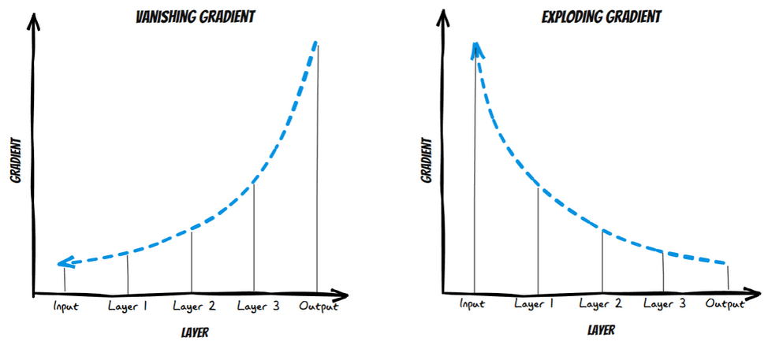
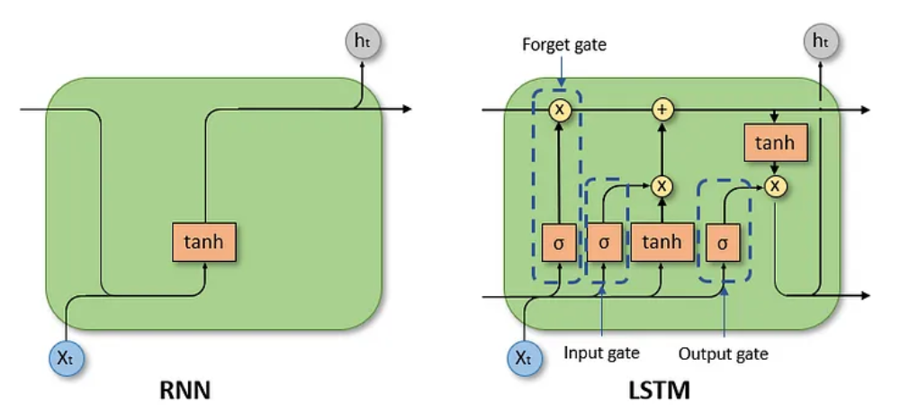
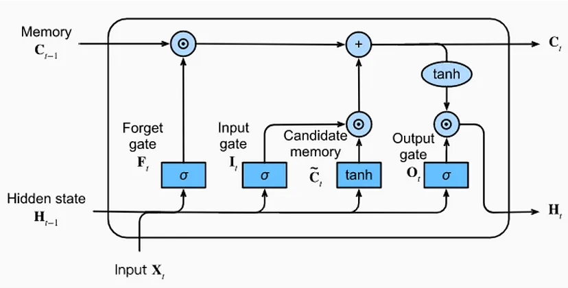
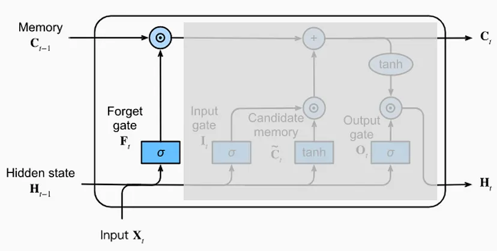
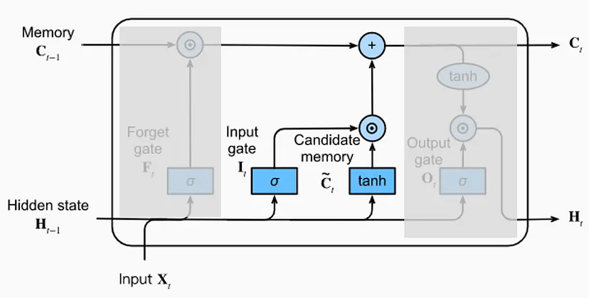
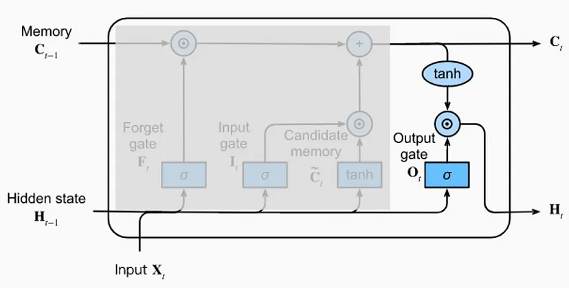
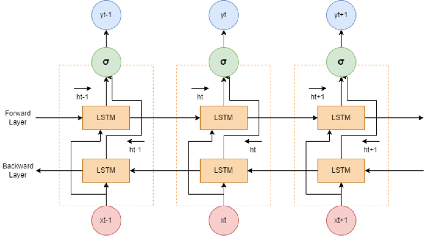
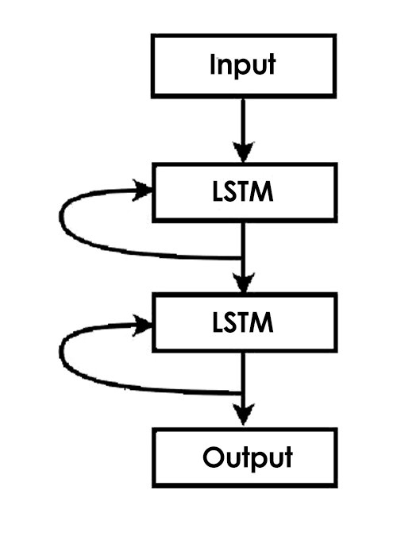
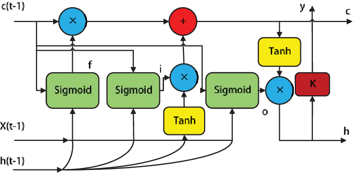

[**🏠 Home**](../README.md) | [**◀️ Recurrent Neural Networks (RNNs)**](../05_Recurrent_Neural_Networks/recurrent_neural_networks.md) | [**Transformers ▶️**](../07_Transformers/07_Transformers.md)


### [**Long Short-Term Memory Networks(LSTMs)**](#long-short-term-memory-networks-lstms)

- [**Introduction to LSTMs**](#introduction-to-lstms)
    - Overview of LSTMs and Motivation behind LSTMs
    - Applications of LSTMs

- [**LSTMs Fundamentals**](#lstms-fundamentals)
    - Basic Concepts
    - LSTMs Architecture
    - Mathematical Formulation

- [**Implementing simple LSTM with PyTorch**](#implementing-simple-lstm-with-pytorch)
    - Using the torch.nn.LSTM class to create a simple LSTM model.

- [**LSTM Variants**](#lstm-variants)
    - Bidirectional LSTMs
    - Stacked LSTMs
    - Peephole LSTMs

- [**Hyperparameter tuning**](#hyperparameter-tuning)
    - Hyperparameter tuning for LSTMs


# Long Short-Term Memory Networks (LSTMs)

## Introduction to LSTMs

### Overview and Motivation of LSTMs

Long Short-Term Memory (LSTM) networks are a type of recurrent neural network (RNN) architecture designed to address the vanishing gradient problem that traditional RNNs face when dealing with long-term dependencies in sequential data.



Vanishing Gradient and Exploding Gradient (Image Source: [Murad Ahmad](https://medium.com/@muradatcorvit23/unlocking-the-power-of-lstm-gru-and-the-struggles-of-rnn-in-managing-extended-sequences-05879b6899d3))   


LSTMs were introduced by Hochreiter and Schmidhuber in 1997. The key innovation of LSTMs is their ability to selectively remember or forget information over long sequences, making them particularly effective for tasks involving sequential data.



RNNs vs LSTMs (Image Source: [Murad Ahmad](https://medium.com/@muradatcorvit23/unlocking-the-power-of-lstm-gru-and-the-struggles-of-rnn-in-managing-extended-sequences-05879b6899d3))

### Applications of LSTMs

LSTMs have found widespread use in various domains, including:

1. Natural Language Processing (NLP):
    - Machine translation
    - Sentiment analysis
    - Text generation
    - Named entity recognition
2. Time Series Analysis:
    - Stock price prediction
    - Weather forecasting
    - Anomaly detection in sensor data
3. Speech Recognition:
    - Converting spoken language to text
    - Speaker identification
4. Music Generation:
    - Composing melodies and harmonies
5. Video Analysis:
    - Action recognition
    - Video captioning

## LSTMs Fundamentals

### Basic Concepts

To understand LSTMs, it's crucial to learn below key concepts:

- **Cell State:** The core component of an LSTM that runs through the entire sequence, allowing information to flow without much alteration.

- **Gates:** Specialized layers that control the flow of information in and out of the cell state. There are three types of gates:
    - **Forget gate:** Decides what information to discard from the cell state
    - **Input gate:** Determines what new information to store in the cell state
    - **Output gate:** Controls what information from the cell state should be output

- **Hidden State:** The output of the LSTM cell at each time step, which can be used for predictions or passed to the next time step.

### LSTMs Architecture

The LSTM architecture consists of a chain of repeating modules, each containing:

- Cell State (C<sub>t</sub>)
- Hidden State (h<sub>t</sub>)
- Forget Gate (f<sub>t</sub>)
- Input Gate (i<sub>t</sub>)
- Output Gate (o<sub>t</sub>)
- Candidate Cell State (C̃<sub>t</sub>)



Image Source: [Ottavio Calzone](https://medium.com/@ottaviocalzone/an-intuitive-explanation-of-lstm-a035eb6ab42c)

### Mathematical Formulation

The LSTM updates its state according to the following equations:

- **Forget Gate:** 

    f<sub>t</sub> = σ(W<sub>f</sub> · [h<sub>t-1</sub>, x<sub>t</sub>] + b<sub>f</sub>)
    
    The forget gate uses a sigmoid function to produce a value between 0 and 1, indicating how much of the previous cell state to retain.

    

    Forget Gate (Image Source: [Ottavio Calzone](https://medium.com/@ottaviocalzone/an-intuitive-explanation-of-lstm-a035eb6ab42c))

- **Input Gate:** 

    i<sub>t</sub> = σ(W<sub>i</sub> · [h<sub>t-1</sub>, x<sub>t</sub>] + b<sub>i</sub>)

    The input gate also uses a sigmoid function to determine which values to update. Additionally, a candidate value is created using a tanh function.

    

    Input Gate and Candidate Memory (Image Source: [Ottavio Calzone](https://medium.com/@ottaviocalzone/an-intuitive-explanation-of-lstm-a035eb6ab42c))

- **Candidate Cell State:** 

    C̃<sub>t</sub> = tanh(W<sub>C</sub> · [h<sub>t-1</sub>, x<sub>t</sub>] + b<sub>C</sub>)

- **Cell State Update:** 

    C<sub>t</sub> = f<sub>t</sub> * C<sub>t-1</sub> + i<sub>t</sub> * C̃<sub>t</sub>

    The cell state is updated by combining the previous cell state (scaled by the forget gate) and the candidate value (scaled by the input gate).

- **Output Gate:** 

    o<sub>t</sub> = σ(W<sub>o</sub> · [h<sub>t-1</sub>, x<sub>t</sub>] + b<sub>o</sub>)

    The output gate determines the next hidden state, which is also the output of the LSTM cell.

    

    Output Gate (Image Source: [Ottavio Calzone](https://medium.com/@ottaviocalzone/an-intuitive-explanation-of-lstm-a035eb6ab42c))

- **Hidden State:** 

    h<sub>t</sub> = o<sub>t</sub> * tanh(C<sub>t</sub>)

### Regularization techniques

To prevent overfitting in LSTMs, you can use regularization techniques such as:

1. Dropout: Randomly setting a fraction of input units to 0 during training.
2. Weight decay: Adding a penalty term to the loss function based on the model's weights. This encourages the weights to be small, reducing overfitting.


##  Implementing simple LSTM with PyTorch

Let's implement a simple LSTM model.

We'll build a basic LSTM model for sequence prediction. This model will consist of an LSTM layer and a fully connected layer to predict an output from the hidden state.

```python
import torch
import torch.nn as nn

class SimpleLSTMModel(nn.Module):
    def __init__(self, input_size, hidden_size, output_size):
        super(SimpleLSTMModel, self).__init__()
        self.hidden_size = hidden_size
        self.lstm = nn.LSTM(input_size, hidden_size)
        self.fc = nn.Linear(hidden_size, output_size)

    def forward(self, x):
        output, _ = self.lstm(x)
        out = self.fc(output[:, -1, :])
        return out

# Parametrers
input_size = 1 
hidden_size = 50
output_size = 1

# Instantiate the model
model = SimpleLSTMModel(input_size, hidden_size, output_size)

# Print the model architecture
print(model)
```


## LSTM Variants

### Bidirectional LSTMs

Bidirectional LSTMs (BiLSTMs) process the input sequence in both forward and backward directions. This allows the network to capture context from both past and future states, which can be particularly useful in tasks like named entity recognition or machine translation.



Image Source: [researchgate.net](https://www.researchgate.net/publication/372735569_Next_Word_Prediction_for_Book_Title_Search_Using_Bi-LSTM_Algorithm)

Here's a simple example of a BiLSTM:

```python
class BiLSTMModel(nn.Module):
    def __init__(self, vocab_size, embedding_dim, hidden_dim, output_dim):
        super().__init__()
        self.embedding = nn.Embedding(vocab_size, embedding_dim)
        self.lstm = nn.LSTM(embedding_dim, hidden_dim, bidirectional=True, batch_first=True)
        self.fc = nn.Linear(hidden_dim * 2, output_dim)

    def forward(self, text):
        embedded = self.embedding(text)
        output, (hidden, cell) = self.lstm(embedded)
        hidden = torch.cat((hidden[-2,:,:], hidden[-1,:,:]), dim=1)
        return self.fc(hidden)

```

### Stacked LSTMs

Stacked LSTMs involve multiple LSTM layers stacked on top of each other, allowing the model to learn more complex representations. 



Image Source: [researchgate.net](https://www.researchgate.net/publication/308837697_Ensemble_of_deep_long_short_term_memory_networks_for_labelling_origin_of_replication_sequences/figures?lo=1)

Here's a simple example of a stacked LSTM:

```python
class StackedLSTMModel(nn.Module):
    def __init__(self, input_size, hidden_size, num_layers, output_size):
        super(StackedLSTMModel, self).__init__()
        self.hidden_size = hidden_size
        self.num_layers = num_layers
        self.lstm = nn.LSTM(input_size, hidden_size, num_layers, batch_first=True)
        self.fc = nn.Linear(hidden_size, output_size)

    def forward(self, x):
        h0 = torch.zeros(self.num_layers, x.size(0), self.hidden_size).to(x.device)
        c0 = torch.zeros(self.num_layers, x.size(0), self.hidden_size).to(x.device)
        out, _ = self.lstm(x, (h0, c0))
        out = self.fc(out[:, -1, :])
        return out
```

### Peephole LSTMs

Peephole LSTMs allow the gate layers to look at the cell state, providing more fine-grained control over the information flow. 



Image Source: [researchgate.net](https://www.researchgate.net/publication/330586980_A_Novel_Method_of_Wind_Speed_Prediction_by_Peephole_LSTM/figures?lo=1)

PyTorch doesn't have a built-in peephole LSTM, you can implement it manually:

```python
class PeepholeLSTMCell(nn.Module):
    def __init__(self, input_size, hidden_size):
        super().__init__()
        self.input_size = input_size
        self.hidden_size = hidden_size

        self.W_i = nn.Linear(input_size + hidden_size, hidden_size)
        self.W_f = nn.Linear(input_size + hidden_size, hidden_size)
        self.W_o = nn.Linear(input_size + hidden_size, hidden_size)
        self.W_c = nn.Linear(input_size + hidden_size, hidden_size)

        self.W_pi = nn.Parameter(torch.Tensor(hidden_size))
        self.W_pf = nn.Parameter(torch.Tensor(hidden_size))
        self.W_po = nn.Parameter(torch.Tensor(hidden_size))

    def forward(self, input, hidden):
        h_prev, c_prev = hidden

        x = torch.cat((input, h_prev), dim=1)

        i = torch.sigmoid(self.W_i(x) + self.W_pi * c_prev)
        f = torch.sigmoid(self.W_f(x) + self.W_pf * c_prev)
        c = f * c_prev + i * torch.tanh(self.W_c(x))
        o = torch.sigmoid(self.W_o(x) + self.W_po * c)
        h = o * torch.tanh(c)

        return h, c

```

## Hyperparameter tuning

Hyperparameter tuning is crucial for optimizing LSTM performance. Key hyperparameters include:

1. Number of LSTM layers
2. Hidden layer size
3. Learning rate
4. Batch size
5. Embedding dimension

You can use techniques like grid search, random search, or Bayesian optimization to find the best hyperparameters. Here's a simple example using random search:

```python
import random

def random_search(param_grid, n_iter=10):
    best_params = None
    best_accuracy = 0

    for _ in range(n_iter):
        params = {k: random.choice(v) for k, v in param_grid.items()}
        model = LSTMSentimentAnalysis(vocab_size, params['embedding_dim'], params['hidden_dim'], output_dim)
# Train and evaluate the model
        accuracy = train_and_evaluate(model, params['learning_rate'], params['batch_size'])

        if accuracy > best_accuracy:
            best_accuracy = accuracy
            best_params = params

    return best_params, best_accuracy

param_grid = {
    'embedding_dim': [50, 100, 200],
    'hidden_dim': [128, 256, 512],
    'learning_rate': [0.001, 0.01, 0.1],
    'batch_size': [16, 32, 64]
}

best_params, best_accuracy = random_search(param_grid)
print(f"Best parameters: {best_params}")
print(f"Best accuracy: {best_accuracy:.2f}%")

```

Further reading: 

1. https://medium.com/@ottaviocalzone/an-intuitive-explanation-of-lstm-a035eb6ab42c
2. https://colah.github.io/posts/2015-08-Understanding-LSTMs/


[**🏠 Home**](../README.md) | [**◀️ Recurrent Neural Networks (RNNs)**](../05_Recurrent_Neural_Networks/recurrent_neural_networks.md) | [**Transformers ▶️**](../07_Transformers/07_Transformers.md)